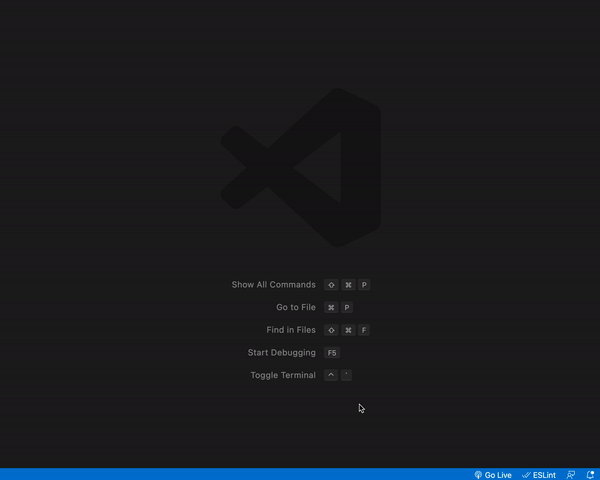
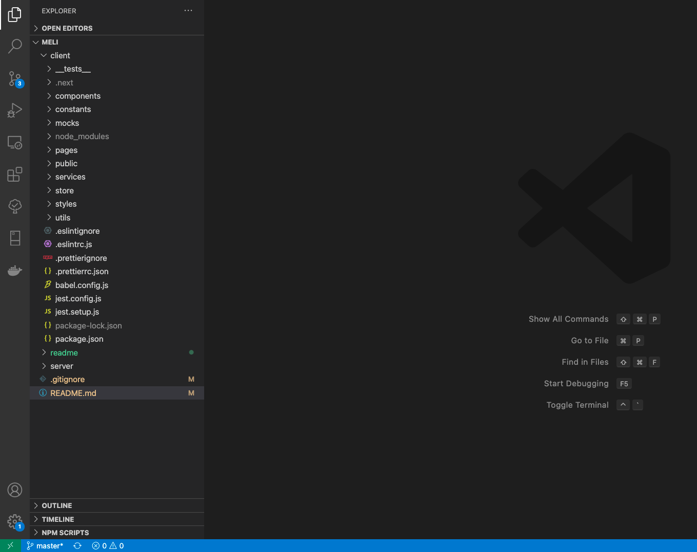
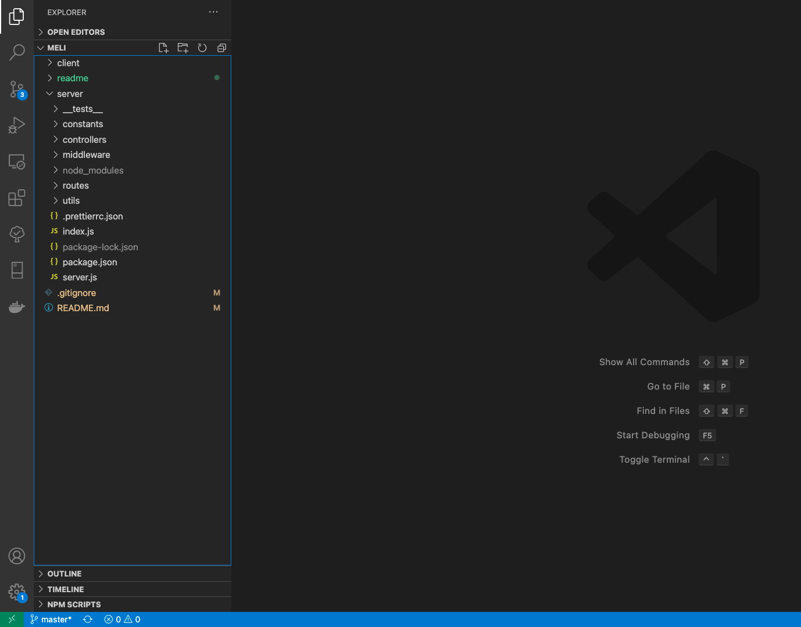
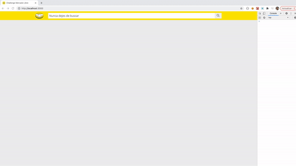
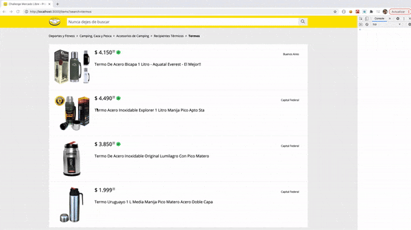
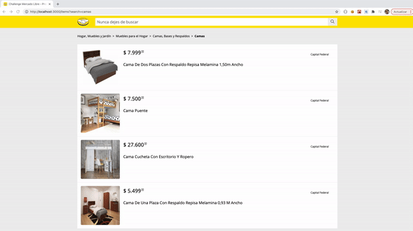

# Challenge de Mercado Libre - Frontend #

## Información General ##
### Test Práctico de Mercado Libre. ###
# #
Se utilizó el desarrollo "Mobile First", teniendo en cuenta la resolución en 3 dispositivos (consola desarrollador de Chrome):

    Iphone 6/7/8            375 x 667
    Ipad                    768 x 1024
    Laptop with touch       1280 x 950

Se utilizó el Framework NextJs, recomendado por los desarrolladores de React, para aplicaciones que poseen contenido dinámico, el mismo implementa Server Side Rendering `SSR`.
 
En el lado del servidor, se utilizó Node, Express y Axios, mientras que en lado del cliente, se utilizó React y SASS para los estilos, incorporando la utilización de varios `Hooks` provistos por React, y gestionando el estado general de la aplicación por medio de `Redux`.

## Iniciar aplicación ##
### Servidor ###
```
cd server
npm install
npm run dev
```
Por defecto corre en el puerto __4000__
### Cliente ###
```
cd client
npm install
npm run dev
```
Por defecto corre en el puerto __3000__
### Ejecutar Test de Control ###
```
cd client
npm run test

cd server
npm run test
```

## Aclaraciones ## 
Se respetaron las especificaciones dadas, juntos con los diseños, tales como márgenes, padding, colores, tamaños de fuentes, tamaño de imagenes. No se justificaron los textos en la descripcion del detalle de un producto, con el objetivo de imitar los diseños.

Se utilizaron los assets dados (iconos del logo, búsqueda y envío).

Para respetar el diseño, donde en el listado de resultados de productos, aparece junto a cada producto la localidad del vendedor, se agrego el campo `location` al formato solicitado como resultado de busqueda, ademas del id, titulo, precio,imagne, condicion y envio. (con el fin de poder mostrarlo en la vista).

No se utilizaron mas datos de la API, para no cambiar los diseños dados, agregando información no solicitada.

Se corroboró que en la consola del navegador, no arroje ningun error ni warning al navegar por la aplicación.

## SEO ##

- Titulos dinamicos, según el contenido de la página que se esta mostrando.
- Nombre de los directorios y de los archivos, autodescriptivos. 
- Aplicación de palabras claves, título, descripción, encabezados.

## Info ##

- Se utilizaron medidas (REMs), Fuentes (google fonts) y colores, declarados en varibales en los archivos SASS, como así también variables para las resoluciones de mobile, tablet y desktop.
- Se quitaron los estilos por defecto, usando `Normalize` para quitar todos los Agent Styles (estilos de los navegadores).

## Tests ##

Los tests fueron desarrollados utilizando Jest, como marco de prueba de la aplicación, y la librería recomendada por los desarrolladores de React, siendo Testing Library, para renderizar los componentes y probar los mismos.

- __@testing-library/react__: accediendo a los metodos (screen y render).
- __@testing-library/jest-dom__: para tener mayor cantidad de metodos disponibles a utilizar.

Además, se utilizaron las siguientes librerías para la configuración de forma correcta de Jest: __full-icu__, __identity-obj-proxy__, y algunas librerías de Babel, para la correcta transpilación del código JS garantizando la compatibilidad con la mayoría de los navegadores.

## Otras librerías utilizadas ##
- __sass__: para escribir los estilos con la sintaxis de sass.
- __prettier__: para dar formato al código, respetando los estándares.
- __eslint__: para validar el código, resptando los estándares de Js.
- __prop-types__: para validar las props en todos los componentes.
- __react-hot-toast__: para mostrar alertas al usuario, sean de éxito o de error en caso de ocurrir alguno.
- __axios__: para realizar las solicitudes HTTP y consumir la API de mercado libre.
- __cors__: para poder vincular el front con el back, permitiendo enviar solicitudes desde una URL del front, a otra URL del back.
- __express__: como servidor.
- __nodemon__: para ver en tiempo real los cambios realizados en el servidor, sin necesidad de reiniciarlo manualmente.
- __supertest__: para realizar los test en la API, en el servidor.

## Estructura General del Proyecto ##
### Frontend ###
- __ __tests__ __: contiene los tests de control.
- __components__: contiene los layouts y ui, desarrollado de forma generica para su reutilización.
- __constants__: contiene las constantes del proyecto.
- __mocks__: contiene datos mockeados, para ser usados en los test de control.
- __pages__: contiene las vistas de la aplicación.
- __public__: contiene los assets accesibles de forma publica.
- __services__: contiene los servicios para comunicarse con la API del backend.
- __store__: contiene la estructura del estado general de la aplicación. `store` contiene el estado general de la App. `reducer` contiene los reducer utilizados (app y product). `selectors` contiene los metodos para acceder a la informacion del estado de la App.
- __store/app__: contiene lo referente al reducer app. `tipos, acciones y el reducer`
- __store/product__: contiene lo referente al reducer product. `tipos, acciones y el reducer`
- __styles__: contiene los estilos del proyecto.
- __utils__: contiene funciones útiles para ser utilizadas por cualquier componente. `requestHandler` es quien se encarga de manejar las llamandas a la API del back (solicitadas desde los servicios), e invoca al `fetchHandler`. 


### Backend ###
- __ __tests__ __: contiene los tests de control.
- __constants__: contiene las constantes del proyecto.
- __controllers__: contiene los controladores de las solicitudes a la API
- __middleware__: contiene un middleware, que se ejecuta cuando se invoca un endpoint no disponible en la API.
- __routes__: contiene los endpoints admitidos por la API.
- __utils__: contiene las funciones útiles, las cuales son requeridas por los controladores, o quien las necesite.
- __index.js__: requiere la configuración del servidor, y lo levanta por defecto en el puerto 4000
- __server.js__: contiene toda la configuración del servidor.


## Vistas ##
### Resultados de búsqueda ###

### Detalle de un producto ###

### 404 ###
